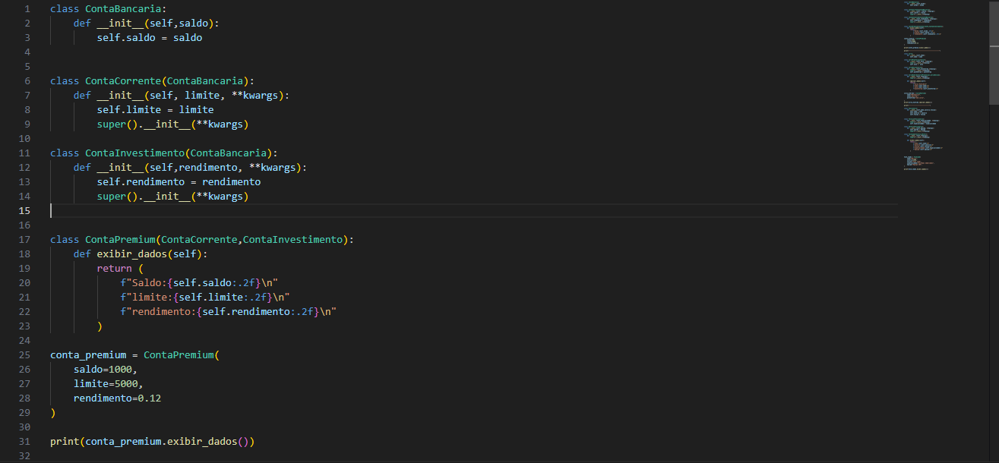

Herança Múltipla Cooperativa em Python

Este repositório contém exercícios e exemplos práticos sobre herança múltipla cooperativa em Python, com foco no uso correto do super() e na compreensão do Method Resolution Order (MRO).

O objetivo é estudar herança múltipla de forma consciente, entendendo como as classes cooperam entre si na inicialização e execução de métodos, evitando conflitos e duplicações.

Demonstração:

Objetivo do Projeto

Compreender como funciona a herança múltipla em Python

Aprender o conceito de herança múltipla cooperativa

Utilizar corretamente o super() em cadeias de herança

Entender a ordem de resolução de métodos (MRO)

Praticar modelagem orientada a objetos de forma didática

Este projeto é voltado para estudantes iniciantes e intermediários em Python que já possuem noções básicas de POO.

Conceitos Abordados

Herança múltipla

Herança múltipla cooperativa

Uso correto do super()

Construtores encadeados

Resolução de métodos (MRO)

Organização e reutilização de código

Boas práticas em Programação Orientada a Objetos

Estrutura do Repositório

aula34.py
Contém os exemplos e exercícios práticos de herança múltipla cooperativa, demonstrando como diferentes classes participam da inicialização e execução de métodos usando super().

herança_multipla_cooperativa_exercicios_foto.png
Imagem ilustrativa relacionada ao conteúdo estudado.

Como Executar os Exemplos

Certifique-se de ter o Python instalado (versão 3.8 ou superior recomendada)

Clone o repositório:

git clone https://github.com/RafaelaDesousa33/heran-a_multipla_cooperativa_exercicios.git

Acesse a pasta do projeto:

cd heran-a_multipla_cooperativa_exercicios

Execute o arquivo:

python aula34.py
